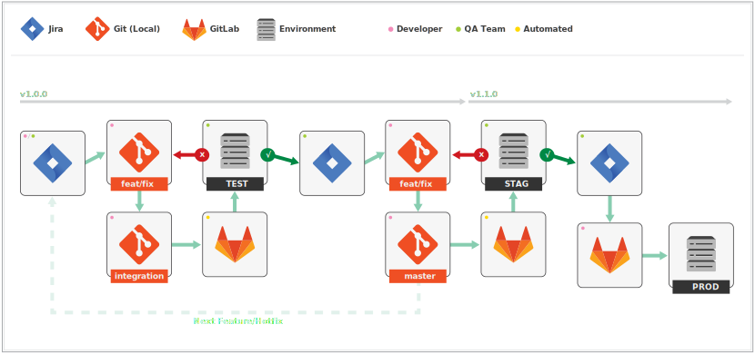

# Continuous Delivery Pipeline

This document was written to work with
[Git Workflow](https://github.com/grafluxe/git-workflow#readme), but can be
tweaked to fit other flows if needed.

## Git Branch Definitions

`master` - Represents production ready code which should always be deployable.

`integration` - Used for testing and preventing conflicts when integrating
 multiple feature/hotfix branches.

## Deployment Environments

**TEST**

- Environment where QA testing occurs (via manual and automated techniques).
- CI tool *auto builds* off HEAD of the `integration` branch.

**STAG**

- Environment where prerelease and performance testing occurs. This environment
  mirrors **PROD**.
- CI tool *auto builds* off HEAD of the `master` branch.

**PROD**

- Environment where the public-facing application lives. The production/live
  server.
- CI tool builds off latest tag of the `master` branch (manual trigger required).

**EXPR**

- Environment where experimental logic can be tested.
- CI tool can build off any commit (manual trigger required).

## Development Flow

In this example, we assume Jira is used for project management and GitLab-CI is
used for continuous integration.

1. Developer creates/is assigned a ticket via Jira.
1. Developer checks out new local branch from `master` to work from (e.g.
   `fix/timer`).
1. Developer completes relevant work, merges branch to `integration` and
   pushes changes to the remote server.
1. GitLab-CI *auto builds* off the HEAD of `integration` and deploys to **TEST**.
1. Developer assigns ticket to QA team via Jira.
1. QA team reviews changes on **TEST**.
1. QA team sets ticket status to "done" in Jira.
1. Developer merges local branch to  `master`, deletes the no longer needed
   local branch and pushes changes to the remote server.
1. GitLab-CI *auto builds* off the HEAD of `master` and deploys to **STAG**.
1. Repeat steps 1–9 for all needed features/hotfixes.
1. Once next release is scheduled, developer creates a release commit (along
   with an annotated tag) on `master` and pushes to the remote server.
1. GitLab-CI *auto builds* off the HEAD of `master` and deploys to **STAG**.
1. QA team does a final pre-release review off of the **STAG** environment.
1. QA team green lights release.
1. Application is deployed to **PROD** via manual trigger off the latest tag in
   GitLab-CI.
